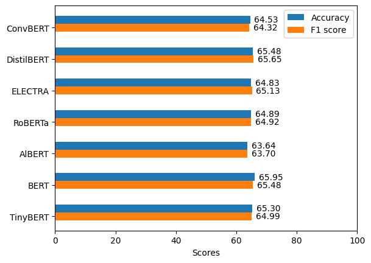

<h2 align="center">AviBert: on Classifying the news about Aircraft</h2>
<p align="center">
  Developed by <a href="https://github.com/ByUnal"> M.Cihat Unal </a> 
</p>

## Overview

This repository focuses on Aircraft, and we work towards developing an Aircraft-specific classification model on a multi-class development set by using BERT and its lightweight and heavyweight variants. Besides, introduces a pipeline that comprises data collection, data tagging and model training. 
Overall, since data and targets are unique, the presented model in this study is also a groundbreaker. Details of the dataset can be investigated further, and the results are compared by using macro-f1 and accuracy scores between models.


## Setup
Install the requirements. I've added torch to requirements.txt, but you can prefer to install by yourself according to different cuda version and resources.
```commandline
pip install -r requirements.txt
```

## Dataset

The **avibert** dataset is available on the Hugging Face Hub.

### Download or Load with 🤗 Datasets

You can easily load the dataset in Python:

```python
from datasets import load_dataset

dataset = load_dataset("byunal/avibert")
```

Or download the CSV files directly from [https://huggingface.co/datasets/byunal/avibert](https://huggingface.co/datasets/byunal/avibert).

- `avibert_train.csv`
- `avibert_val.csv`
- `avibert_test.csv`

## Run the Code
I've concluded hyperparameter tuning by using optuna, and therefore `main.py` fixed accordingly. Also, you can train standalone model by using `train_loop()`

## Results
The results that we obtained our experiments as below:



You can also see the best parameters for the models after hyperparameter optimization in *results/params.txt*

Some of the conclusions obtained:
- In DistilBert training, the model overt fits the training data up to %93 accuracy score however it generalizes badly.
- torch.clip_norm function demolishes the model success rate, it shows that additional algorithms are unnecessary for bert base models.
## Acknowledgement
This work has been accepted by the SIU 2025 Conference. The paper link/details will be shared as soon as the paper is published. 
